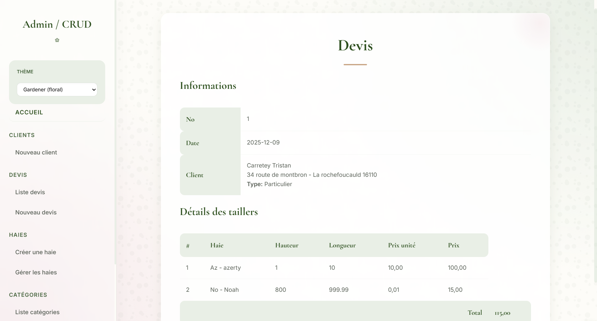
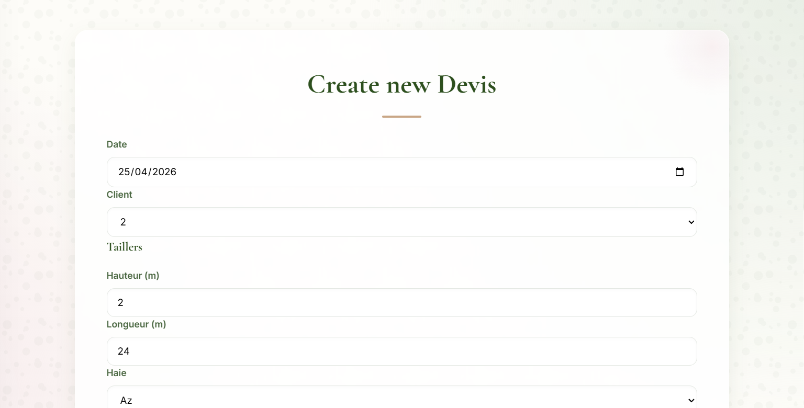

# Le P'tit J@rdinier - Système de Gestion Admin

Ce projet est une solution complète de gestion CRUD conçue pour une entreprise de jardinage et de paysagisme. Développé avec **Symfony 7**, il permet de piloter efficacement les clients, les devis et les interventions techniques.

## Fonctionnalités Principales

Le système est articulé autour de plusieurs modules clés :

- **Gestion des Clients** : Enregistrement et suivi des dossiers clients.
- **Gestion des Devis** : Création, consultation et administration des devis pour les prestations de jardinage.
- **Administration des Haies** : Module spécifique pour la gestion et la configuration des types de haies.
- **Catégories et Services** : Organisation des prestations par catégories logiques.
- **Planification des Tailles** : Suivi des interventions de taille et de maintenance.

## Redesign de l'Interface (Thème Gardener Floral)

L'interface utilisateur a été entièrement repensée pour offrir une expérience **premium et immersive**. L'objectif est de refléter l'identité "naturelle" de l'entreprise tout en conservant une efficacité professionnelle.

### Points forts du design :
- **Architecture Side-Nav** : Une barre de navigation latérale moderne utilisant le *glassmorphism* pour une meilleure hiérarchie visuelle.
- **Identité Visuelle** : Palette chromatique basée sur des tons organiques (Vert Sauge, Vert Forêt, Rose Poudré).
- **Expérience Utilisateur** : Utilisation de polices de caractères élégantes (**Cormorant Garamond**) et de micro-animations fluides pour une navigation agréable.
- **Adaptabilité** : Design responsive capable de s'adapter aux différents terminaux de consultation.

## Aperçus

Voici les dernières captures d'écran illustrant le nouveau thème :

### Liste des Devis


### Création d'un Devis


## Stack Technique

- **Framework** : Symfony 7.3
- **Langage** : PHP 8.2+
- **Base de données** : Doctrine ORM
- **Moteur de template** : Twig
- **Frontend** : Symfony AssetMapper, Stimulus & Turbo (pour une navigation ultra-fluide sans rechargement de page)
- **Style** : CSS Vanilla (Design System personnalisé)

## Installation

1. Cloner le dépôt.
2. Installer les dépendances :
   ```bash
   composer install
   ```
3. Lancer le serveur de développement :
   ```bash
   symfony serve
   ```
